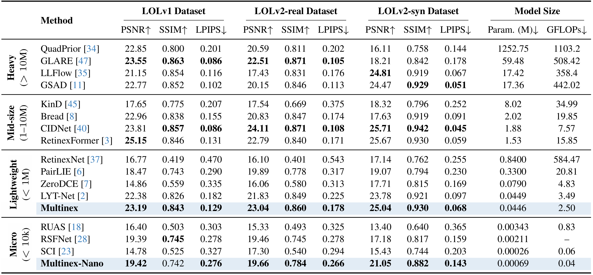
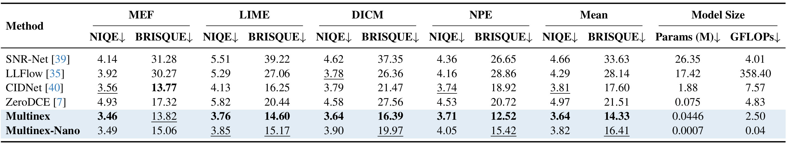
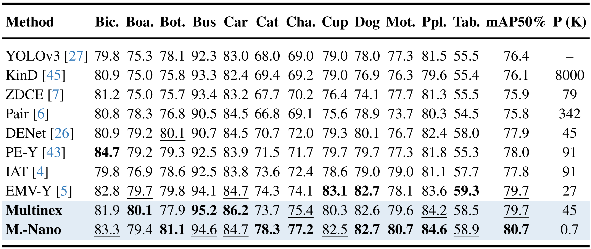

<div align="center">
<p align="center">  </p>

# Multinex: Lightweight Low-Light Image Enhancement via Multi-prior Retinex (CVPR 2026)

**[Alexandru Brateanu](https://albrateanu.github.io/), [Tingting Mu](https://personalpages.manchester.ac.uk/staff/tingting.mu/Site/About_Me.html), [Codruta O. Ancuti](https://ro.linkedin.com/in/codruta), [Cosmin Ancuti](https://www.linkedin.com/in/cosmin-ancuti-86b3872/)**

[](https://arxiv.org/abs/2604.10359)
[](https://arxiv.org/pdf/2604.10359)
[](https://albrateanu.github.io/Multinex/)
[](https://drive.google.com/file/d/1-bRljca_GG1wvwJYP56bTHhpJZkJmulB/view)


**Consider giving our repository a :star: star :star: if you find it useful!**
</div>

### News
- **20.06.2026:** Clarified repository licensing and commercial-use terms. Multinex is source-available for non-commercial research and educational use under PolyForm Noncommercial 1.0.0; commercial use requires separate written permission.
- **25.04.2026**: Model weights for object detection on ExDark are now available for download. Read `Detection/README.md` for more details.
- **14.04.2026 :** [Pre-print](https://arxiv.org/abs/2604.10359), [code](https://github.com/albrateanu/multinex/), and [paper page](https://albrateanu.github.io/Multinex/) for **Multinex** (accepted at CVPR 2026) are released!

<div align="justify">

> **Abstract:** *Low-light image enhancement (LLIE) aims to restore natural visibility, color fidelity, and structural detail under severe illumination degradation. State-of-the-art (SOTA) LLIE techniques often rely on large models and multi-stage training, limiting practicality for edge deployment. Moreover, their dependence on a single color space introduces instability and visible exposure or color artifacts. To address these, we propose Multinex, an ultra-lightweight structured framework that integrates multiple fine-grained representations within a principled Retinex residual formulation. It decomposes an image into illumination and color prior stacks derived from distinct analytic representations, and learns to fuse these representations into luminance and reflectance adjustments required to correct exposure. By prioritizing enhancement over reconstruction and exploiting lightweight neural operations, Multinex significantly reduces computational cost, exemplified by its lightweight (45K parameters) and nano (0.7K parameters) versions. Extensive benchmarks show that all lightweight variants significantly outperform their corresponding lightweight SOTA models, and reach comparable performance to heavy models.*

</div>

## Network Architecture


### Introduction
This source-available repository contains the official implementation of **Multinex** for low-light image enhancement. It provides training and testing code for paired-image enhancement on standard benchmarks, together with pretrained checkpoints for direct evaluation.

**Please Note:** Installation and running instructions for Object Detection on ExDark are available under `Detection/README.md`.

## Results
Quantitative results for _Enhancement_ (LOL-v1, LOL-v2, MEF, DICM, LIME, NPE), and _Detection_ (ExDark)

<details>
<summary><strong>LOL Datasets</strong> (click to expand) </summary>


</details>

<details>
<summary><strong>No-Reference Datasets</strong> (click to expand) </summary>


</details>


<details>
<summary><strong>Object Detection on ExDark</strong> (click to expand) </summary>


</details>

&nbsp;

&nbsp;

## 1. Create Environment

We use a PyTorch 2 environment.

### 1.1 Create the environment

```bash
conda create -n multinex python=3.9 -y
conda activate multinex
```

### 1.2 Install PyTorch 2

Example for CUDA 11.8:

```bash
# With Pip
pip install torch torchvision torchaudio --index-url https://download.pytorch.org/whl/cu118

# With Conda
conda install pytorch torchvision torchaudio pytorch-cuda=11.8 -c pytorch -c nvidia
```

Change this to accommodate your CUDA version requirements.

### 1.3 Install dependencies

```bash
pip install matplotlib scikit-learn scikit-image opencv-python yacs joblib natsort h5py tqdm tensorboard
pip install einops gdown addict future lmdb numpy pyyaml requests scipy yapf lpips thop timm pytorch_msssim
```

### 1.4 Install BasicSR

```bash
pip install -e .
```

**Please Note:** `python setup.py develop` has been deprecated. As a result, the above installation is recommended. With this in mind, using `basicsr` must be done as `python -m basicsr.<filename>` rather than `python basicsr/<filename>.py`.

&nbsp;

## 2. Prepare Dataset

Download the LOLv1 and LOLv2 datasets:

LOLv1 - [Google Drive](https://drive.google.com/file/d/1vhJg75hIpYvsmryyaxdygAWeHuiY_HWu/view?usp=sharing)

LOLv2 - [Google Drive](https://drive.google.com/file/d/1OMfP6Ks2QKJcru1wS2eP629PgvKqF2Tw/view?usp=sharing)

Organize the datasets as follows:

<details close>
<summary><b>Dataset structure</b></summary>

```text
data/
├── LOLv1/
│   ├── Train/
│   │   ├── input/
│   │   └── target/
│   └── Test/
│       ├── input/
│       └── target/
└── LOLv2/
    ├── Real_captured/
    │   ├── Train/
    │   │   ├── Low/
    │   │   └── Normal/
    │   └── Test/
    │       ├── Low/
    │       └── Normal/
    └── Synthetic/
        ├── Train/
        │   ├── Low/
        │   └── Normal/
        └── Test/
            ├── Low/
            └── Normal/
```

</details>

&nbsp;

## 3. Testing

Model weights are available under `pretrained_weights/`, and are contained within the repository due to their small file sizes (280 KB for Multinex, 20 KB for Multinex-Nano). These weights are Model Materials covered by the non-commercial license notice in [`pretrained_weights/README.md`](pretrained_weights/README.md) and [`MODEL_CARD.md`](MODEL_CARD.md).

### Multinex

```bash
# LOL-v1
python Enhancement/test.py --opt Options/Multinex_LOL-v1.yaml --weights pretrained_weights/Multinex_LOLv1.pth --dataset LOL_v1

# LOL-v2-real
python Enhancement/test.py --opt Options/Multinex_LOL-v2-real.yaml --weights pretrained_weights/Multinex_LOLv2_real.pth --dataset LOL_v2_real

# LOL-v2-synthetic
python Enhancement/test.py --opt Options/Multinex_LOL-v2-syn.yaml --weights pretrained_weights/Multinex_LOLv2_syn.pth --dataset LOL_v2_synthetic
```

### Multinex-Nano

```bash
# LOL-v1
python Enhancement/test.py --opt Options/MultinexNano_LOLv1.yaml --weights pretrained_weights/MultinexNano_LOLv1.pth --dataset LOL_v1

# LOL-v2-real
python Enhancement/test.py --opt Options/MultinexNano_LOL-v2-real.yaml --weights pretrained_weights/MultinexNano_LOLv2_real.pth --dataset LOL_v2_real

# LOL-v2-synthetic
python Enhancement/test.py --opt Options/MultinexNano_LOL-v2-synthetic.yaml --weights pretrained_weights/MultinexNano_LOLv2_syn.pth --dataset LOL_v2_synthetic
```

- #### Self-ensemble testing strategy

For stronger results, add `--self_ensemble` argument.

```bash
python Enhancement/test.py --opt Options/Multinex_LOL-v1.yaml --weights pretrained_weights/Multinex_LOLv1.pth --dataset LOL_v1 --self_ensemble
```

&nbsp;

## 4. Training

Training is launched through the BasicSR entrypoint.

```bash
# Multinex on LOL-v1
python -m basicsr.train --opt Options/Multinex_LOL-v1.yaml

# Multinex on LOL-v2-real
python -m basicsr.train --opt Options/Multinex_LOL-v2-real.yaml

# Multinex on LOL-v2-synthetic
python -m basicsr.train --opt Options/Multinex_LOL-v2-syn.yaml

# Multinex-Nano on LOL-v1
python -m basicsr.train --opt Options/MultinexNano_LOLv1.yaml

# Multinex-Nano on LOL-v2-real
python -m basicsr.train --opt Options/MultinexNano_LOL-v2-real.yaml

# Multinex-Nano on LOL-v2-synthetic
python -m basicsr.train --opt Options/MultinexNano_LOL-v2-synthetic.yaml
```

**Note:** For best results, use  `val.val_freq: 5` in the yaml configs under `Options/` directory.

&nbsp;

## 5. Citation

Cite our work if Multinex is useful to your research.

```
@inproceedings{multinex2026,
  title     = {Multinex: Lightweight Low-light Image Enhancement via Multi-prior Retinex},
  author    = {Alexandru Brateanu and Tingting Mu and Codruta O. Ancuti and Cosmin Ancuti},
  booktitle = {Proceedings of the IEEE/CVF Conference on Computer Vision and Pattern Recognition (CVPR)},
  year      = {2026}
}
```

## License

Copyright (c) 2026 Alexandru Brateanu. Multinex is source-available for non-commercial research and educational use under the [PolyForm Noncommercial License 1.0.0](LICENSE). It is not open-source software in the OSI sense, and commercial use is not permitted without a separate written license.

The public non-commercial license applies to original Multinex source code, model definitions, documentation, pretrained weights, checkpoints, configuration files, and related model materials authored by Alexandru Brateanu, unless otherwise stated. Third-party components remain under their original licenses; see [THIRD_PARTY_NOTICES.md](THIRD_PARTY_NOTICES.md).

For clarity, "Model Materials" include model weights, checkpoints, adapters, LoRAs, tokenizer files, configuration files, architecture code, training and inference code, documentation, and any modified, merged, quantized, distilled, or fine-tuned versions. See [MODEL_CARD.md](MODEL_CARD.md) for the model-specific license notice.

You may use, modify, and share Multinex only for permitted non-commercial purposes, such as:

- academic research
- personal study
- non-commercial experimentation
- reproducibility and benchmarking for non-commercial research
- teaching and educational use

Commercial use includes, but is not limited to:

- use by or for a for-profit company
- integration into a commercial product or service
- internal company research, prototyping, evaluation, or benchmarking
- paid consulting or client work
- SaaS/API deployment
- use in a startup, product pipeline, or revenue-generating system
- training, fine-tuning, or deploying models for commercial advantage
- use of Model Materials in or to support any customer deliverable, commercial R&D, hosted API, internal business process, or revenue-generating workflow

Commercial access is available only through collaboration, partnership, or a separate written commercial license. Commercial evaluation or production use requires a separate written agreement. See [COMMERCIAL_USE.md](COMMERCIAL_USE.md) for commercial collaboration options.

For commercial collaboration, contact:

Alexandru Brateanu<br>
Email: albrateanu@gmail.com

This repository is provided as research software. No warranty is provided. See [LICENSE](LICENSE) for the full license terms and [RELEASE_NOTES.md](RELEASE_NOTES.md) for the license-clarification release note.
