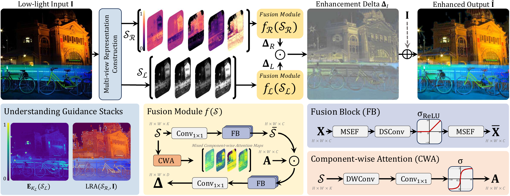

# Multinex论文

原仓库：[code](https://github.com/albrateanu/multinex/)

- **Please Note:** Installation and running instructions for Object Detection on ExDark are available under `Detection/README.md`.

网络结构



原结果


# 优化旧代码仓库的提示词

```
帮我完成

- 根据当前data目录，修改对应的数据集路径
- 我使用远程服务器，不要看本地环境
- 补充需要的依赖
- 暂时不使用预训练权重
- 能够【能自动恢复最新 `.state`】就行了，不需要【在仅有 `*_G.pth` 时退化为仅权重恢复】
- 训练时的周期性验证需要输出pSNR和SSIM
- 训练时额外输出独立的 `logs/train.log`、`logs/val.log`；续训时训练日志不需要追加模式
- tb输出到根目录 `tb_logger/<配置名>/`也行，不需要改
- 【生成 `net_g_<iter>.pth`、`net_g_latest.pth`；best 位于实验根目录且带指标名，不是 `models/latest_G.pth`、`best_G.pth`、`<iter>_G.pth`】你改一下
- 【已计算 PSNR、RGB SSIM、LPIPS-alex，但只打印到终端】要打印到终端并保存到metric.csv
- 【会保存增强图，但目录是 `results/...`，不是 `test_result/<数据集>/enhanced/`】修改一下目录
- 【没有 `test.log`，没有最终要求的 `metric.csv`】修改一下
- 【有独立复杂度脚本，但 THOP 的 MACs 被直接标成 GFLOPs】其他项目的常见做法到底是什么，我看好像确实大多数是使用MACs的，要统一口径啊
- 【测试脚本把 LQ、GT 分别排序后直接 `zip`，没有检查同名、缺失、重复或数量差异】数据集是准备好的，直接排序应该也行吧
```


# 创建环境

创建环境：

```bash
git clone https://github.com/jaxhur/multinex.git
cd multinex

conda create -n multinex python=3.9 -y
conda activate multinex

pip install torch==2.8.0 torchvision==0.23.0 torchaudio==2.8.0 --index-url https://download.pytorch.org/whl/cu128

pip install -r requirements.txt
pip install -e .
```

> **Please Note:** `python setup.py develop` has been deprecated. As a result, the above installation is recommended. With this in mind, using `basicsr` must be done as `python -m basicsr.<filename>` rather than `python basicsr/<filename>.py`.


```
git pull --ff-only origin main

BASICSR_EXT=False python -m pip install \
  --editable . \
  --force-reinstall \
  --no-deps \
  --no-build-isolation
```


# 数据集

LOLv1、LOLv2-real、LOLv2-syn

```
apt install -y unzip
mkdir data
cd ./data
# LOL-v1
gdown "https://drive.google.com/uc?id=1mAN3ll5wWwt1Xz0C7uio31-NJu-50S8Z"
# LOL-v2重命名
gdown "https://drive.google.com/uc?id=1L0UnJg6gZ4Eb7It2EuNxP0L3lQNmKMaP"

unzip LOL-v1.zip -d LOL-v1
unzip LOL-v2-renamed.zip -d LOL-v2

rm LOL-v1.zip LOL-v2-renamed.zip
cd ../
```

```
data/
├── LOLv1/
│   ├── Train/
│   │   ├── input/
│   │   └── target/
│   └── Test/
│       ├── input/
│       └── target/
└── LOLv2/
    ├── Real_captured/
    │   ├── Train/
    │   │   ├── Low/
    │   │   └── Normal/
    │   └── Test/
    │       ├── Low/
    │       └── Normal/
    └── Synthetic/
        ├── Train/
        │   ├── Low/
        │   └── Normal/
        └── Test/
            ├── Low/
            └── Normal/
```


# 训练

训练产物

```

```


# 测试

预训练模型：`pretrained_weights/`

- 280 KB for Multinex
- 20 KB for Multinex-Nano

Self-ensemble testing strategy：For stronger results, add `--self_ensemble` argument.

```bash
python Enhancement/test.py --opt Options/Multinex_LOL-v1.yaml --weights pretrained_weights/Multinex_LOLv1.pth --dataset LOL_v1 --self_ensemble
```

测试产物

- **Note:** For best results, use  `val.val_freq: 5` in the yaml configs under `Options/` directory.

```

```


# LOLv1

训练

- batch_size = 
- patch_size =

```
# Multinex on LOL-v1
python -m basicsr.train --opt Options/Multinex_LOL-v1.yaml

# Multinex-Nano on LOL-v1
python -m basicsr.train --opt Options/MultinexNano_LOLv1.yaml
```

测试

- PSNR：
- SSIM：
- LPIPS：
- 参数量(M)：
- FLOPS(G)：

```
python Enhancement/test.py --opt Options/Multinex_LOL-v1.yaml --weights experiments/Multinex_LOL-v1/models/best_G.pth --dataset LOL_v1

# nano
python Enhancement/test.py --opt Options/MultinexNano_LOLv1.yaml --weights pretrained_weights/MultinexNano_LOLv1.pth --dataset LOL_v1
```


# LOLv2-real

训练

- batch_size = 
- patch_size =

```
# Multinex on LOL-v2-real
python -m basicsr.train --opt Options/Multinex_LOL-v2-real.yaml

# Multinex-Nano on LOL-v2-real
python -m basicsr.train --opt Options/MultinexNano_LOL-v2-real.yaml
```

测试

- PSNR：
- SSIM：
- LPIPS：
- 参数量(M)：
- FLOPS(G)：

```
# 
python Enhancement/test.py --opt Options/Multinex_LOL-v2-real.yaml --weights pretrained_weights/Multinex_LOLv2_real.pth --dataset LOL_v2_real

# nano
python Enhancement/test.py --opt Options/MultinexNano_LOL-v2-real.yaml --weights pretrained_weights/MultinexNano_LOLv2_real.pth --dataset LOL_v2_real
```


# LOLv2-syn

训练

- batch_size = 
- patch_size =

```
# Multinex on LOL-v2-synthetic
python -m basicsr.train --opt Options/Multinex_LOL-v2-syn.yaml

# Multinex-Nano on LOL-v2-synthetic
python -m basicsr.train --opt Options/MultinexNano_LOL-v2-synthetic.yaml
```

测试

- PSNR：
- SSIM：
- LPIPS：
- 参数量(M)：
- FLOPS(G)：

```
python Enhancement/test.py --opt Options/Multinex_LOL-v2-syn.yaml --weights pretrained_weights/Multinex_LOLv2_syn.pth --dataset LOL_v2_synthetic


# nano
python Enhancement/test.py --opt Options/MultinexNano_LOL-v2-synthetic.yaml --weights pretrained_weights/MultinexNano_LOLv2_syn.pth --dataset LOL_v2_synthetic
```


&nbsp;


